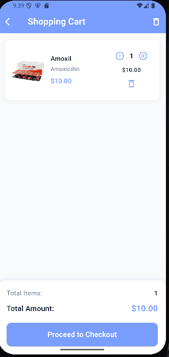
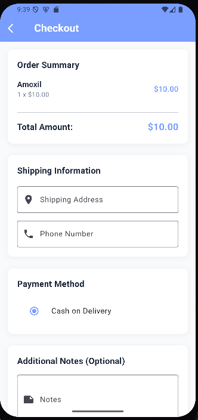
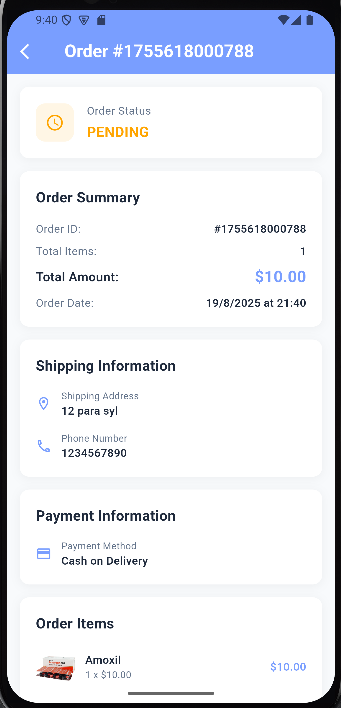
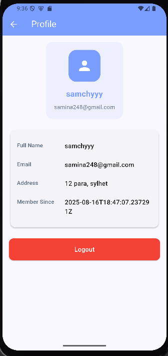

---

# **ShebaPharma - Medicine & Pharmacy E-commerce App**

A Flutter-based, production-ready app for buying medicines and healthcare products with a clean, responsive UI/UX.

---

## **🚀 Setup & Run**

1. **Clone repo**

```bash
git clone <repository-url>
cd shebapharmaa
```

2. **Install dependencies**

```bash
flutter pub get
```

3. **Run the app**

```bash
flutter run
```

**Prerequisites:** Flutter SDK, Android Studio/VS Code, Emulator or physical device, Internet connection

---

## **✅ Features**

* **Authentication:** Signup, Login, Profile, Secure JWT tokens, Logout
* **Home & Navigation:** Categories, Featured medicines, Bottom navigation
* **Medicine Browsing:** Search, filters, sorting, stock status, grid layout
* **Medicine Details:** Complete info, reviews, add to cart, favorite medicines

---

## **🛠 Tools & Libraries**

* **Framework:** Flutter
* **API Communication:** `http`
* **Local Storage:** `shared_preferences`
* **Design:** Material 3, responsive layouts

---

## **📂 App Structure**

```
lib/
├── core/         # API config & services
├── screens/      # Auth, Home, Cart, Orders
└── main.dart     # App entry point
```

---

## **📸 Screenshots**

<p align="center">    </p> <p align="center">    </p> <p align="center">    </p> <p align="center">    </p> <p align="center">  </p>


